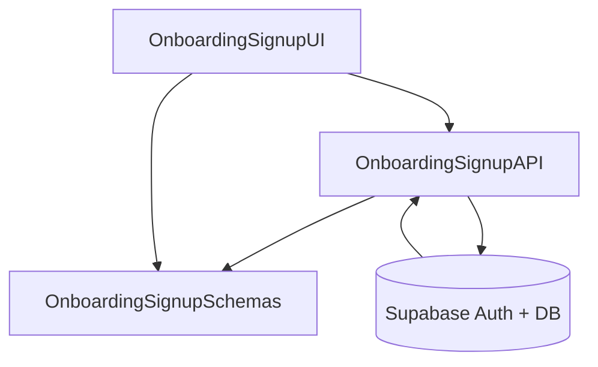

# Implementation Modules Plan (Use Case 1 – 회원가입 & 역할선택)

## 개요
- **OnboardingSignupAPI** (`src/features/onboarding/backend`): Supabase Auth 계정 생성과 `profiles` 초기화를 트랜잭션으로 처리하는 Hono 라우터 및 서비스 계층.
- **OnboardingSignupUI** (`src/features/onboarding/components/signup-form.tsx`, `src/app/signup/page.tsx`): 역할·인증 방식 선택을 포함한 회원가입 폼과 제출 흐름을 담당하는 클라이언트 레이어.
- **OnboardingSignupSchemas** (`src/features/onboarding/lib/dto.ts`): 회원가입 요청/응답을 검증하고 프런트·백에서 공유할 Zod 스키마 집합.

## Diagram

## Implementation Plan

### OnboardingSignupAPI (`src/features/onboarding/backend`)
- `schema.ts`: `SignupRequestSchema`(이메일, 비밀번호, 비밀번호 확인, 역할, 인증 방식)와 `SignupResponseSchema` 정의.
- `service.ts`: Supabase Auth `signUp` 호출 → `profiles` 테이블 삽입을 단일 트랜잭션으로 처리, 실패 시 롤백 후 도메인 에러코드(`error.ts`) 반환.
- `route.ts`: `POST /onboarding/signup` 라우터 구현, `respond/success/failure` 유틸 사용, 레이트 리밋·중복 이메일 등 오류 매핑.
- 단위 테스트: `tests/backend/onboarding/service.test.ts` 작성(vitest). 성공, 중복 이메일, 프로필 삽입 실패 롤백 시나리오 mock 으로 검증.

### OnboardingSignupUI (`src/features/onboarding/components/signup-form.tsx`, `src/app/signup/page.tsx`)
- `signup-form.tsx`: `react-hook-form` + `@hookform/resolvers/zod` 도입, 역할/인증 방식 라디오 버튼, 비밀번호 확인 로직, 오류/성공 메시지 처리.
- `hooks/useSignupMutation.ts`: React Query `useMutation`으로 `/api/onboarding/signup` 호출, `extractApiErrorMessage` 재사용, 성공 시 역할별 온보딩 경로로 라우팅.
- `src/app/signup/page.tsx`: 기존 로직을 신규 폼 컴포넌트 사용 구조로 리팩터링, 인증 사용자 리다이렉션 유지.
- QA 시트: `docs/qa/onboarding-signup.md` 작성(정상 가입, 비밀번호 불일치, 중복 이메일, 레이트 리밋, 성공 후 리다이렉션 검증).

### OnboardingSignupSchemas (`src/features/onboarding/lib/dto.ts`)
- `SignupRequestSchema`, `SignupResponseSchema`, `SignupErrorSchema`를 정의하고 타입을 export.
- 프런트엔드 훅/폼과 백엔드 서비스 모두 동일 스키마 사용하도록 경로 정리.
- 단위 테스트: `tests/features/onboarding/dto.test.ts`에서 스키마 파싱 성공/실패 케이스 검증.

### 공통 작업
- 새 Hono 라우터를 `src/backend/hono/app.ts`에 등록.
- React Query 키 유틸(`src/lib/react-query/queryKeys.ts`)에 `auth.signup` 키 정의.
- Vitest와 testing 환경이 없다면 `package.json`에 `"test": "vitest"` 스크립트와 `vitest.config.ts`를 추가하여 위 단위 테스트 실행 가능하게 구성.