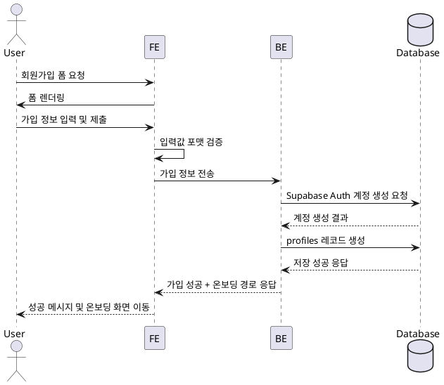

# Use Case: 회원가입 & 권한선택

## Primary Actor
- 신규 가입을 시도하는 사용자 (인플루언서 또는 광고주)

## Precondition
- 사용자는 서비스 접속이 가능하며 아직 Supabase Auth 계정을 보유하지 않았다.

## Trigger
- 사용자가 회원가입 페이지에서 필수 정보를 입력하고 "가입하기" 버튼을 클릭한다.

## Main Scenario
1. 사용자가 이름, 휴대폰 번호, 이메일, 비밀번호, 인증 방식, 역할 유형을 입력한다.
2. 프론트엔드는 필수 입력값과 포맷(이메일, 휴대폰)을 클라이언트에서 1차 검증한다.
3. 프론트엔드는 백엔드 API로 가입 정보를 전달한다.
4. 백엔드는 Supabase Auth에 사용자 계정을 생성하고 결과를 확인한다.
5. 백엔드는 `profiles` 테이블에 역할과 기본 정보를 저장한다.
6. 백엔드는 역할 유형에 따라 인플루언서/광고주 세부 온보딩 경로를 포함한 응답을 반환한다.
7. 프론트엔드는 성공 배너와 함께 후속 온보딩 화면으로 라우팅한다.

## Edge Cases
- 이미 등록된 이메일: 백엔드는 Supabase Auth 오류를 확인하고 "이미 가입된 이메일" 메시지를 반환한다.
- SMS/이메일 인증 코드 요청 과다: 백엔드는 레이트 리밋 초과 오류를 반환하며 일정 시간 후 재시도를 안내한다.
- 네트워크 오류로 프로필 저장 실패: 백엔드는 트랜잭션을 롤백하고 "다시 시도" 안내 메시지를 제공한다.

## Business Rules
- 역할 유형은 `influencer` 또는 `advertiser` 중 하나여야 한다.
- 인증 방식은 이메일 또는 SMS 중 하나이며, 선택한 방식으로만 검증 코드를 발송한다.
- 가입 성공 시 `profiles.onboarding_status`는 `pending`으로 초기화된다.
- Supabase Auth 계정 생성과 프로필 저장은 동일 트랜잭션으로 처리(둘 중 하나라도 실패 시 전체 롤백)해야 한다.

## Sequence Diagram

