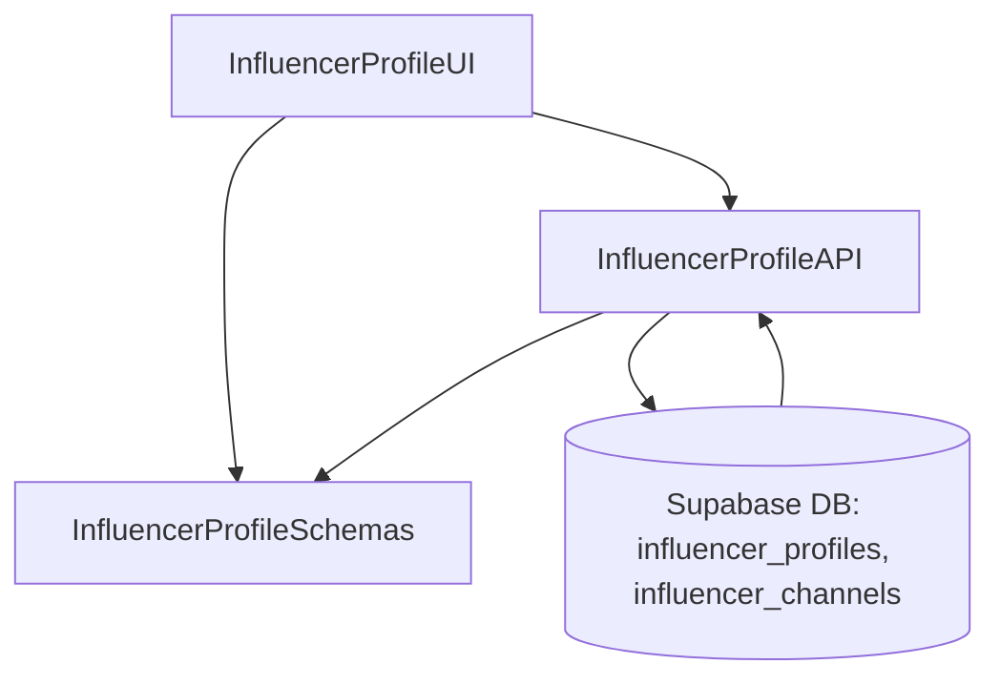

# Implementation Modules Plan (Use Case 2 – 인플루언서 정보 등록)

## 개요
- **InfluencerProfileAPI** (`src/features/influencer/backend`): 인플루언서 기본 정보·채널 데이터 upsert 및 검증을 담당하는 Hono 라우터/서비스.
- **InfluencerProfileUI** (`src/features/influencer/components/profile-form.tsx`, `src/app/(protected)/influencer/profile/page.tsx`): 생년월일·채널 등록 폼과 제출 흐름을 제공하는 클라이언트 컴포넌트.
- **InfluencerProfileSchemas** (`src/features/influencer/lib/dto.ts`): 인플루언서 프로필/채널 DTO를 정의해 프런트·백단에서 공용 사용.

## Diagram

## Implementation Plan

### InfluencerProfileAPI (`src/features/influencer/backend`)
- `schema.ts`: `InfluencerProfileInputSchema`(생년월일, 채널 배열) 정의. 채널 항목은 플랫폼 enum(`youtube`, `instagram`, `naver`, `threads`, `tiktok`), HTTPS URL, 구독자 수 optional.
- `service.ts`: `influencer_profiles` upsert 후 채널 리스트 처리. UNIQUE(`influencer_id`, `platform`, `channel_url`) 위반 시 `CHANNEL_DUPLICATE` 에러 반환, 생년월일 기준 만14세 미만이면 `UNDER_AGE` 에러. 전체 작업은 트랜잭션.
- `route.ts`: `GET /influencers/profile`, `POST /influencers/profile` 구현. 인증 context에서 `user_id` 가져오고 `respond()` 패턴 사용.
- 단위 테스트: `tests/features/influencer/service.test.ts`에서 성공, 중복 채널, 미성년자, 트랜잭션 롤백 케이스 검증.

### InfluencerProfileUI (`src/features/influencer/components/profile-form.tsx`, `src/app/(protected)/influencer/profile/page.tsx`)
- 폼 컴포넌트: `react-hook-form` + `useFieldArray`로 채널 추가/삭제, zod resolver 사용. 각 채널 카드에 `picsum.photos` 이미지 활용.
- 훅: `hooks/useInfluencerProfileQuery.ts`, `hooks/useUpsertInfluencerProfile.ts` 작성, React Query로 데이터 fetch/mutate. 성공 시 토스트(shadcn `useToast`)와 Onboarding 상태 업데이트.
- 페이지: 보호된 경로 `/influencer/profile`에서 폼 컴포넌트 렌더링, 온보딩 상태 배너 표시.
- QA 시트: `docs/qa/influencer-profile-form.md` 작성(채널 추가, 중복 경고, 미성년자 차단, 저장 성공/실패, 검증 대기).

### InfluencerProfileSchemas (`src/features/influencer/lib/dto.ts`)
- `InfluencerProfileSchema`, `InfluencerChannelSchema`, `InfluencerProfileResponseSchema` 정의 및 export.
- 프런트/백 공용 타입 사용으로 타입 일관성 확보.
- 단위 테스트: `tests/features/influencer/dto.test.ts`에서 DTO 파싱 검증.

### 공통 작업
- 새 훅/쿼리 키를 `src/lib/react-query/queryKeys.ts`에 `influencer.profile` 등으로 추가.
- Supabase upsert 트랜잭션을 위한 헬퍼(`src/backend/supabase/with-transaction.ts`) 도입 시 재사용 고려.
- 인증 가드 미들웨어가 요구된다면 `src/backend/middleware/auth.ts`에 보호 로직 추가.