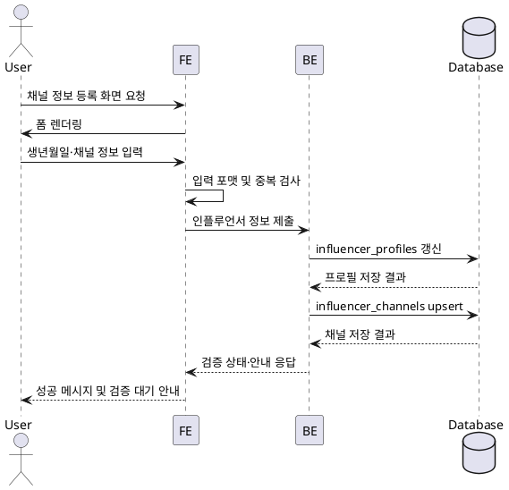

# Use Case: 인플루언서 정보 등록

## Primary Actor
- 채널 정보를 등록해 온보딩을 완료하려는 인플루언서 사용자

## Precondition
- 사용자는 인플루언서 역할로 로그인한 상태이고 기본 회원가입을 마쳐 `추가 정보 입력` 안내 화면을 보고 있다.
- 사용자는 아직 채널 검증을 완료하지 않아 체험 지원 버튼이 비활성화되어 있다.

## Trigger
- 사용자가 온보딩 배너나 알림에서 "채널 정보 등록" 버튼을 클릭한다.

## Main Scenario
1. 사용자가 채널 정보 등록 화면에 진입하면 프론트엔드가 생년월일과 채널 입력 폼을 렌더링한다.
2. 사용자는 생년월일, 채널 플랫폼, 채널 이름, 채널 URL, 구독/팔로워 수(선택), 주요 업로드 빈도를 입력한다.
3. 프론트엔드는 각 입력값을 즉시 검증한다(날짜 범위, URL 형식, 숫자 여부 등).
4. 프론트엔드는 정제된 값을 백엔드 API로 전달하고 중복 채널 여부 확인을 요청한다.
5. 백엔드는 트랜잭션 내에서 `influencer_profiles`를 갱신하고, 채널 목록을 `influencer_channels`에 upsert한다.
6. 백엔드는 중복·검증 상태를 계산해 결과(승인/대기/보류)와 함께 검증 작업 큐에 비동기 검증을 등록한다.
7. 백엔드는 성공 응답에 상태 메시지와 후속 안내 URL을 포함해 반환하고, 프론트엔드는 성공 배너와 함께 검증 진행 현황을 표시한다.

## Edge Cases
- 채널 URL 형식 오류: 프론트엔드가 제출 전 즉시 경고를 표시하며 수정 요청.
- 이미 등록된 채널: 백엔드가 중복을 감지해 해당 채널을 제외한 나머지 저장 후 경고 메시지를 반환하거나 전체 요청을 실패 처리한다.
- 검증 큐 등록 실패: 백엔드가 롤백하고 "잠시 후 다시 시도" 메시지로 응답한다.
- 생년월일이 서비스 허용 연령 미만: 백엔드가 거부하고 최소 연령 안내를 포함한 오류를 반환한다.

## Business Rules
- 최소 한 개 이상의 SNS 채널을 등록해야 완료로 인정한다.
- 지원 플랫폼은 `youtube`, `instagram`, `naver`, `threads`, `tiktok` 중 하나여야 한다.
- 채널 URL은 HTTPS 스킴을 사용해야 하며, 동일한 채널(플랫폼+URL)은 한 번만 등록할 수 있다.
- 생년월일은 만 14세 이상이어야 하며, 검증 대기 중인 경우 체험 지원은 제한된다.
- 모든 저장 작업은 단일 트랜잭션으로 처리해 부분 저장을 방지한다.

## Sequence Diagram
