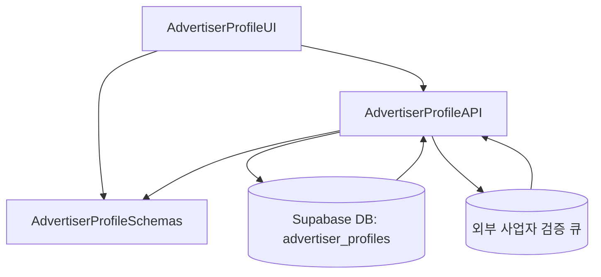

# Implementation Modules Plan (Use Case 3 – 광고주 정보 등록)

## 개요
- **AdvertiserProfileAPI** (`src/features/advertiser/backend`): 사업자 정보 저장과 검증 상태를 관리하는 Hono 라우터/서비스 계층.
- **AdvertiserProfileUI** (`src/features/advertiser/components/profile-form.tsx`, `src/app/(protected)/advertiser/profile/page.tsx`): 업체 정보 입력 폼과 상태 안내를 제공하는 클라이언트 레이어.
- **AdvertiserProfileSchemas** (`src/features/advertiser/lib/dto.ts`): 사업자 프로필 요청/응답 스키마를 프런트·백에서 공유하는 DTO 모듈.

## Diagram

## Implementation Plan

### AdvertiserProfileAPI (`src/features/advertiser/backend`)
- `schema.ts`: `AdvertiserProfileInputSchema`(업체명, 위치, 카테고리, 사업자등록번호)와 `AdvertiserProfileResponseSchema` 작성. 등록번호는 하이픈 제거 후 10자리 숫자 검증.
- `service.ts`: `advertiser_profiles` upsert 처리, 중복 사업자등록번호 시 `BUSINESS_ID_DUPLICATE` 에러 반환, 외부 검증 큐 enqueue(비동기 스텁 함수) 실패 시 롤백. 상태 필드(`pending/approved/rejected`) 초기화.
- `route.ts`: `GET /advertisers/profile`, `POST /advertisers/profile` 라우터 구현. `respond()` 사용, 인증 context에서 광고주 user_id 파악.
- 단위 테스트: `tests/features/advertiser/service.test.ts`에서 성공 저장, 중복 번호, 검증 큐 실패 롤백 케이스를 mock Supabase/큐로 검증.

### AdvertiserProfileUI (`src/features/advertiser/components/profile-form.tsx`, `src/app/(protected)/advertiser/profile/page.tsx`)
- 폼 컴포넌트: `react-hook-form` + `zodResolver`, 사업자등록번호 자동 포맷팅, 상태 배너(검증대기/승인/반려) 표시, `picsum.photos` 배너 이미지 활용.
- 훅: `hooks/useAdvertiserProfileQuery.ts`, `hooks/useUpsertAdvertiserProfile.ts` 작성, React Query로 fetch/mutate. 성공 시 토스트 및 온보딩 진행 안내.
- 페이지: 보호된 경로 `/advertiser/profile`에 폼 렌더링, 승인되기 전 체험단 등록이 제한됨을 알리는 안내 컴포넌트 추가.
- QA 시트: `docs/qa/advertiser-profile-form.md`에 정상 등록, 포맷 오류, 중복 번호, 검증 실패, 승인 후 플로우 등 체크리스트 작성.

### AdvertiserProfileSchemas (`src/features/advertiser/lib/dto.ts`)
- `AdvertiserProfileSchema`, `BusinessRegistrationSchema`, `AdvertiserProfileStatusSchema` 정의 및 export, UI/서비스에서 타입 공유.
- 단위 테스트: `tests/features/advertiser/dto.test.ts`로 스키마 파싱 성공/실패 케이스 확인.

### 공통 작업
- React Query 키(`advertiser.profile`)를 `src/lib/react-query/queryKeys.ts`에 추가.
- 외부 검증 큐 enqueue 함수를 `src/backend/middleware` 또는 `src/backend/lib/tasks` 등 공유 위치에 정의하고, 서비스 테스트 시 mock 가능하도록 인터페이스화.
- 새 라우터를 `src/backend/hono/app.ts`에 등록하며 순서 유지.