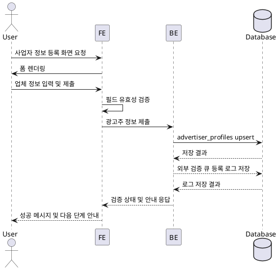

# Use Case: 광고주 정보 등록

## Primary Actor
- 체험단을 등록할 준비가 된 광고주 사용자

## Precondition
- 사용자는 광고주 역할로 로그인했으며 기본 회원가입을 마친 상태다.
- 아직 사업자 정보가 승인되지 않아 체험단 관리 기능이 잠금 상태다.

## Trigger
- 사용자가 대시보드 배너 또는 알림에서 "사업자 정보 등록" 버튼을 클릭한다.

## Main Scenario
1. 사용자가 정보 등록 화면에 진입하면 프론트엔드는 업체명, 위치, 카테고리, 사업자등록번호 입력 폼을 렌더링한다.
2. 사용자는 필수 필드를 입력하고 제출 버튼을 클릭한다.
3. 프론트엔드는 공백 여부, 문자열 길이, 사업자등록번호 패턴 등을 즉시 검증한다.
4. 프론트엔드는 정제된 값을 백엔드 API에 전달하고 중복 여부 확인을 요청한다.
5. 백엔드는 트랜잭션 내에서 `advertiser_profiles` 레코드를 upsert하고, 기존 값이 있을 경우 최신 정보로 갱신한다.
6. 백엔드는 사업자등록번호가 중복이거나 외부 검증 큐 등록이 실패하면 롤백하고 오류를 반환한다.
7. 성공 시 백엔드는 검증 상태(`pending`/`approved`)와 온보딩 진행 상황 URL을 포함한 응답을 반환하며, 프론트엔드는 성공 배너와 다음 단계 안내를 표시한다.

## Edge Cases
- 형식 오류: 프론트엔드가 즉시 입력 경고를 표시하고 제출을 막는다.
- 사업자등록번호 중복: 백엔드가 저장을 중단하고 "이미 등록된 번호" 메시지를 반환한다.
- 외부 검증 큐 등록 실패: 백엔드가 전체 트랜잭션을 롤백하고 "잠시 후 다시 시도" 메시지를 반환한다.
- 네트워크 오류: 프론트엔드는 재시도 버튼과 함께 사용자에게 알림을 보여준다.

## Business Rules
- 사업자등록번호는 10자리 숫자이며 하이픈 없이 저장한다.
- 동일한 사업자등록번호는 하나의 광고주 계정에만 연결할 수 있다.
- 필수 필드는 모두 채워져야 하며, 승인 상태가 `approved`가 되기 전까지 체험단 등록은 제한된다.
- 모든 저장 작업은 단일 트랜잭션으로 처리되어야 하며 부분 저장을 허용하지 않는다.

## Sequence Diagram

