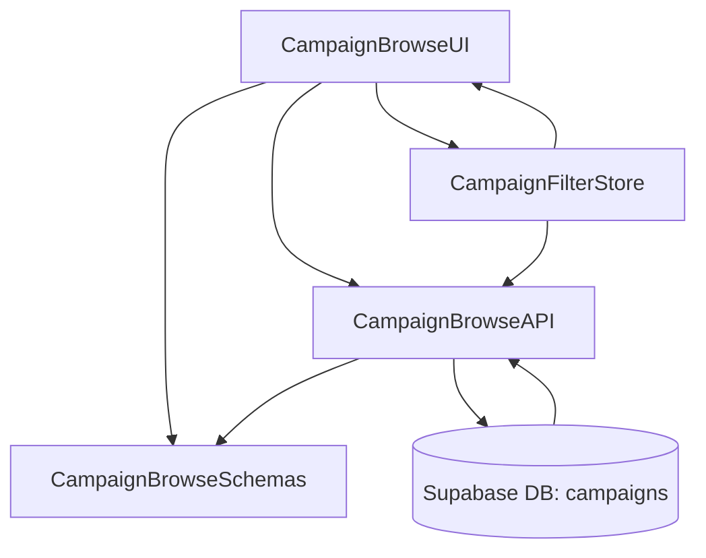

# Implementation Modules Plan (Use Case 4 – 홈 & 체험단 목록 탐색)

## 개요
- **CampaignBrowseAPI** (`src/features/campaigns/browse/backend`): 모집 중 체험단 목록과 필터/정렬/페이지네이션을 처리하는 Hono 라우터·서비스.
- **CampaignBrowseUI** (`src/features/campaigns/browse/components`, `src/app/(protected)/dashboard/page.tsx`, `src/app/page.tsx`): 필터 바, 카드 리스트, 로딩/빈 상태를 제공하는 클라이언트 컴포넌트 집합.
- **CampaignBrowseSchemas** (`src/features/campaigns/lib/dto.ts`): 목록/필터/메타 정보를 검증하고 프런트·백에서 공유할 DTO.
- **CampaignFilterStore** (`src/features/campaigns/browse/hooks/useCampaignFilters.ts`): 목록 필터 상태를 관리하는 zustand 스토어와 React Query 연동 훅.

## Diagram

## Implementation Plan

### CampaignBrowseAPI (`src/features/campaigns/browse/backend`)
- `schema.ts`: `CampaignFilterSchema`(status, category, region, sort, page, pageSize)와 `CampaignListResponseSchema` 정의.
- `service.ts`: Supabase 질의 빌더 작성. 기본 조건으로 `status = 'recruiting'`, 필터/페이지네이션/정렬(`recent`, `endingSoon`) 적용, 빈 결과 처리.
- `route.ts`: `GET /campaigns` 라우터 구현, 쿼리 파라미터 파싱 후 `respond()` 패턴으로 결과 반환.
- 단위 테스트: `tests/features/campaigns/browse-service.test.ts`에서 필터 조합, 페이지네이션, 빈 결과, 잘못된 파라미터 케이스(Mock Supabase client) 검증.

### CampaignBrowseUI (`src/features/campaigns/browse/components`, `src/app/(protected)/dashboard/page.tsx`, `src/app/page.tsx`)
- 컴포넌트: `CampaignFilterBar`, `CampaignCard`, `CampaignList`, 스켈레톤/Empty states. `picsum.photos` 이미지를 카드 썸네일로 사용.
- 페이지 통합: 홈(`src/app/page.tsx`) 및 대시보드(`src/app/(protected)/dashboard/page.tsx`)에서 필터 바 + 리스트 컴포넌트 조합, SEO 메타 데이터 보강.
- React Query 훅: `hooks/useCampaignListQuery.ts` 작성, `queryKeys.campaigns.list(filters)` 사용, 필터 변경 시 invalidate.
- QA 시트: `docs/004/qa/campaign-browse.md` 작성(기본 로딩, 필터/정렬 변경, 빈 결과 메시지, 네트워크 오류 배너, 비로그인 접근 처리).

### CampaignBrowseSchemas (`src/features/campaigns/lib/dto.ts`)
- 기존/신규 DTO 통합: `CampaignSummarySchema`, `CampaignMetaSchema`, `CampaignFilterSchema` export. 상태 enum(`CampaignStatus`) 정의.
- 단위 테스트: `tests/features/campaigns/dto.test.ts`에 목록 응답 파싱 성공/실패 케이스 추가.

### CampaignFilterStore (`src/features/campaigns/browse/hooks/useCampaignFilters.ts`)
- zustand 스토어로 필터 상태(카테고리, 지역, 정렬, 페이지) 관리, URL 쿼리와 동기화하는 헬퍼 포함.
- React Hook `useCampaignFilterStore` 제공하여 UI와 훅 간 상태 공유.
- 테스트: `tests/features/campaigns/filter-store.test.ts`에서 초기값, 업데이트, 리셋 로직 검증.

### 공통 작업
- React Query 키(`campaigns.list`)를 `src/lib/react-query/queryKeys.ts`에 정의.
- 새 라우터는 `src/backend/hono/app.ts`에 등록하고, 홈/대시보드 페이지에 `"use client"` 지시자를 유지.
- 에러 배너/토스트는 기존 UI 컴포넌트(`@/components/ui/alert` 등) 재사용.
