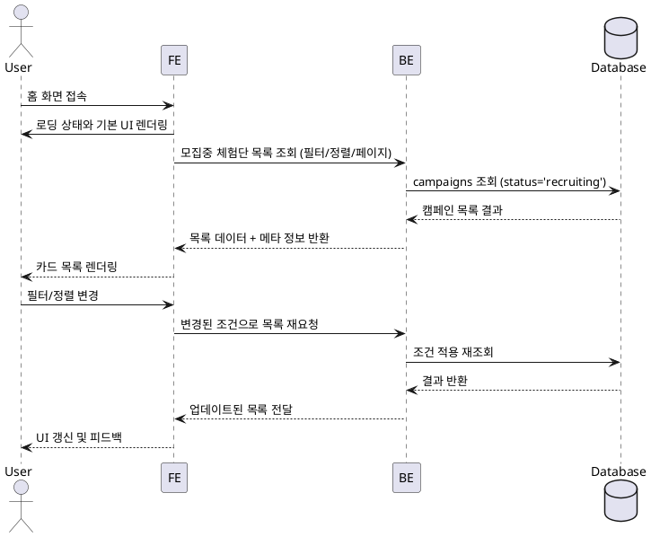

# Use Case: 홈 & 체험단 목록 탐색

## Primary Actor
- 체험단을 둘러보려는 로그인 사용자(인플루언서 중심, 비로그인 허용 시에도 동일 흐름 적용)

## Precondition
- 사용자는 웹/모바일 앱에서 홈 화면에 접근할 수 있으며, 네트워크 연결이 정상이다.
- (선택) 로그인 사용자의 경우 필터 기본값이 개인화 설정으로 저장되어 있다.

## Trigger
- 사용자가 홈 화면에 접속하거나 상단 메뉴에서 "체험단"을 선택한다.

## Main Scenario
1. 사용자가 홈 화면에 진입하면 프론트엔드는 기본 필터(모집중, 최신순)를 적용한 목록 요청을 준비한다.
2. 프론트엔드는 히어로 배너·추천 섹션과 함께 목록 컨테이너를 렌더링하고 로딩 상태를 표시한다.
3. 프론트엔드는 백엔드 API에 필터/정렬/페이지 정보를 포함해 모집 중 체험단 목록을 조회한다.
4. 백엔드는 `campaigns` 테이블에서 `status = 'recruiting'`인 레코드를 페이징·정렬 기준에 맞게 조회하고, 필요 시 캐시 또는 추천 랭킹 데이터를 결합해 응답한다.
5. 백엔드는 각 캠페인의 요약 정보(제목, 혜택, 모집 마감일, 이미지 URL, 남은 슬롯)를 포함한 목록을 반환한다.
6. 프론트엔드는 응답을 받아 로딩 상태를 해제하고 카드 형태로 목록을 렌더링한다.
7. 사용자가 필터(카테고리, 지역, 정렬 옵션)를 변경하면 프론트엔드는 쿼리 파라미터를 업데이트하고 3~6단계를 반복한다.

## Edge Cases
- 네트워크 오류: 프론트엔드는 오류 배너와 재시도 버튼을 표시한다.
- 데이터 없음: 백엔드는 빈 목록을 반환하고 프론트엔드는 "현재 모집 중인 체험단이 없습니다" 메시지를 노출한다.
- 잘못된 필터 값: 백엔드는 400 오류로 응답하며, 프론트엔드는 기본 필터로 되돌리고 안내 메시지를 보여준다.
- 비로그인 상태에서 접근 제한된 캠페인 포함: 백엔드는 해당 항목을 제외하거나 "로그인이 필요" 플래그를 함께 반환한다.

## Business Rules
- 기본 조회는 모집중(`recruiting`) 상태의 캠페인만 포함하며 마감일 오름차순 또는 최신 생성일 내림차순을 제공한다.
- 페이지당 최대 20개의 카드만 반환해 성능과 UI 일관성을 유지한다.
- 필터 가능한 카테고리/지역 값은 사전에 정의된 ENUM 또는 마스터 데이터와 일치해야 한다.
- 추천 배너/특가 섹션은 별도의 API 또는 캐시에서 제공되되, 목록 불러오기에 실패하더라도 홈 화면 로딩을 차단하지 않는다.
- 로그인 사용자는 마지막으로 적용한 필터 조합을 로컬 저장소나 서버에 저장해 재방문 시 기본값으로 사용한다.

## Sequence Diagram

