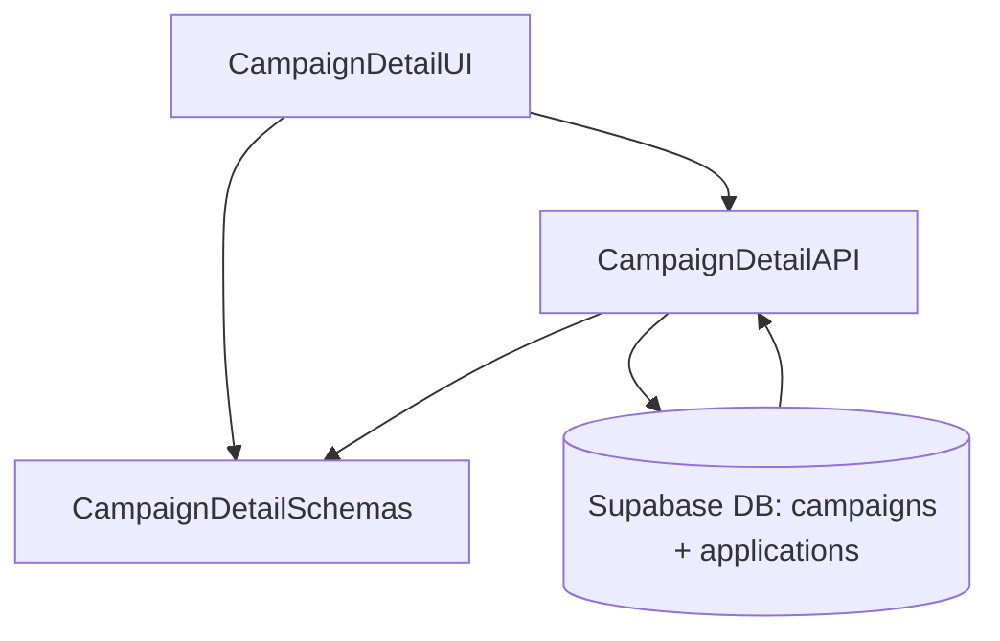

# Implementation Modules Plan (Use Case 5 – 체험단 상세)

## 개요
- **CampaignDetailAPI** (`src/features/campaigns/detail/backend`): 단일 체험단 상세 조회와 지원 가능 여부 계산을 담당하는 Hono 라우터/서비스.
- **CampaignDetailUI** (`src/features/campaigns/detail/components`, `src/app/campaigns/[id]/page.tsx`): 체험단 상세 화면과 지원 버튼 상태 표시를 담당하는 클라이언트 레이어.
- **CampaignDetailSchemas** (`src/features/campaigns/lib/dto.ts`): 체험단 상세 DTO, 지원 가능 플래그, 남은 슬롯 계산 결과를 공유하는 스키마 집합.

## Diagram

## Implementation Plan

### CampaignDetailAPI (`src/features/campaigns/detail/backend`)
- `schema.ts`: `CampaignDetailParamsSchema`(campaign_id), `CampaignDetailResponseSchema`(제목, 혜택, 기간, 미션, 매장, 모집 인원, 상태, 남은 슬롯, 지원 가능 여부 + 사유) 정의.
- `service.ts`: `campaigns` 단건 조회 후 상태/기간 기반 지원 가능 여부 계산, `applications` 테이블에서 현재 사용자 신청 여부/상태 확인, 남은 슬롯 계산.
- `route.ts`: `GET /campaigns/:id` 구현, 인증 context에서 사용자 정보(역할/검증 상태) 확인 후 응답에 포함. 404/권한 부족/종료 상태 등 실패 케이스 처리.
- 단위 테스트: `tests/features/campaigns/detail-service.test.ts`에서 모집중/종료/이미 지원/정원 초과/권한 미충족 케이스 검증(Mock Supabase client & current user context).

### CampaignDetailUI (`src/features/campaigns/detail/components`, `src/app/campaigns/[id]/page.tsx`)
- 컴포넌트: `CampaignDetailHeader`, `CampaignDetailInfo`, `CampaignDetailActions` 작성, `picsum.photos` 이미지를 Hero로 사용.
- 훅: `hooks/useCampaignDetailQuery.ts` 작성, React Query로 상세 데이터 fetch, 상태에 따라 버튼 활성화/비활성 메시지 표시.
- 페이지 통합: `/campaigns/[id]/page.tsx`에서 상세 컴포넌트 렌더링, 지원 버튼 클릭 시 지원 다이얼로그(Use Case 6 연계)로 이동.
- QA 시트: `docs/005/qa/campaign-detail.md` 작성(모집중/종료/이미 지원/권한 부족/네트워크 오류/없는 ID).

### CampaignDetailSchemas (`src/features/campaigns/lib/dto.ts`)
- 상세 DTO(`CampaignDetailSchema`), 지원 가능 플래그(`ApplicationEligibilitySchema`), 사유 enum 정의.
- 프런트/백에서 공용 타입으로 활용하여 React Query 데이터 파싱 시 오류를 방지.
- 단위 테스트: `tests/features/campaigns/dto.test.ts`에 상세 DTO 검증 케이스 추가.

### 공통 작업
- React Query 키(`campaigns.detail`)를 `src/lib/react-query/queryKeys.ts`에 추가.
- 새 라우터 등록 시 `src/backend/hono/app.ts`에 detail 라우트 포함.
- 지원 버튼과 연계되는 CampaignApplicationModule(Use Case 6) 호출 포인트를 정의하고, 상태 invalidate(`useCampaignDetailQuery` 재요청) 전략 마련.
