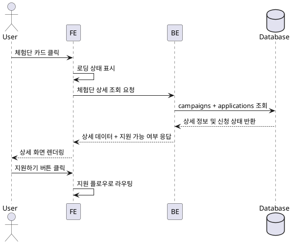

# Use Case: 체험단 상세

## Primary Actor
- 체험단 참여를 검토하려는 인플루언서 사용자

## Precondition
- 사용자는 인플루언서로 로그인했으며 기본 프로필과 채널 정보 등록을 완료했다.
- 사용자는 홈 또는 검색을 통해 관심 체험단 카드를 클릭할 수 있는 상태다.

## Trigger
- 사용자가 체험단 카드(또는 링크)를 클릭해 상세 페이지로 이동한다.

## Main Scenario
1. 프론트엔드는 URL 파라미터로 전달된 체험단 ID를 기반으로 로딩 상태를 표시한다.
2. 프론트엔드는 백엔드 API에 체험단 상세 정보 조회를 요청한다.
3. 백엔드는 `campaigns` 테이블에서 기본 정보(제목, 혜택, 기간, 미션, 매장, 모집 인원)를 조회하고, 모집 상태와 남은 슬롯을 계산한다.
4. 백엔드는 `applications` 테이블을 조회해 사용자의 지원 여부 및 현재 상태를 확인한다.
5. 백엔드는 상세 정보와 지원 가능 여부(버튼 활성화 여부, 사유 메시지)를 포함한 응답을 반환한다.
6. 프론트엔드는 응답을 렌더링하고, 지원 가능 시 "지원하기" 버튼을, 불가능 시 제한 안내를 표시한다.
7. 사용자가 지원 버튼을 누르면 체험단 지원 플로우로 라우팅한다.

## Edge Cases
- 체험단이 모집 종료 상태: 백엔드는 상태를 반환하고 프론트엔드는 "모집이 종료되었습니다" 가드를 노출한다.
- 사용자가 이미 지원한 경우: 백엔드는 지원 상태를 `applications`에서 확인해 버튼 대신 현황 배지를 표시한다.
- 잘못된 ID 접근: 백엔드는 404를 반환하고 프론트엔드는 오류 페이지 또는 목록으로 리다이렉트한다.
- 네트워크 오류: 프론트엔드는 에러 배너와 재시도 옵션을 제공한다.

## Business Rules
- 모집 상태가 `recruiting`이고 남은 슬롯이 1 이상이며 사용자가 승인된 인플루언서인 경우에만 지원 버튼을 활성화한다.
- 모집 종료(`recruitment_closed`, `completed`) 또는 모집 인원 초과 시 지원 버튼은 비활성화되고 사유를 명시한다.
- 이미 지원한 사용자는 상태 배지를 통해 진행 현황(신청완료/선정/반려)을 확인할 수 있다.
- 상세 정보는 공개 필드만 포함하며, 내부 메모나 개인 정보는 노출하지 않는다.

## Sequence Diagram

