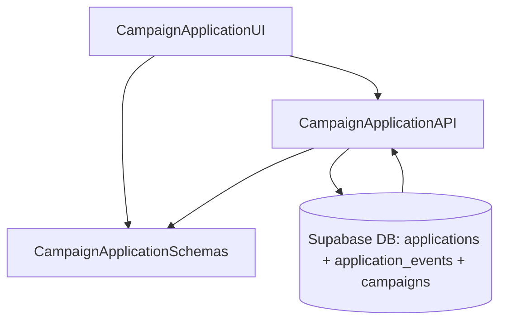

# Implementation Modules Plan (Use Case 6 – 체험단 지원)

## 개요
- **CampaignApplicationAPI** (`src/features/applications/submit/backend`): 체험단 신청 생성, 중복/기간 검증, 감사 로그 기록을 담당하는 Hono 라우터·서비스.
- **CampaignApplicationUI** (`src/features/applications/submit/components`, `src/features/campaigns/detail/components/application-dialog.tsx`): 지원 다이얼로그와 제출 UX를 담당하는 클라이언트 레이어.
- **CampaignApplicationSchemas** (`src/features/applications/lib/dto.ts`): 신청 입력/응답 DTO, 상태 메시지, 에러 코드를 공유하는 스키마 모듈.

## Diagram

## Implementation Plan

### CampaignApplicationAPI (`src/features/applications/submit/backend`)
- `schema.ts`: `CampaignApplicationInputSchema`(campaign_id, motivation_note, planned_visit_on)와 `CampaignApplicationResponseSchema` 정의.
- `service.ts`: 모집 상태/기간 확인(`campaigns`), 중복 신청 여부(`applications` UNIQUE) 검증 후 트랜잭션으로 신청 레코드 insert + `application_events`에 `submitted` 로그 기록. 실패 시 도메인 에러코드(`error.ts`) 반환 (`DUPLICATE_APPLICATION`, `CAMPAIGN_NOT_OPEN`, `INVALID_VISIT_DATE`).
- `route.ts`: `POST /applications` 라우터 구현, 인증 context에서 influence user id 확보, `respond()` 패턴으로 성공/실패 응답.
- 단위 테스트: `tests/features/applications/submit-service.test.ts` 작성. 성공, 중복, 모집 종료, 잘못된 방문 예정일, 이벤트 로깅 여부를 mock Supabase client로 검증.

### CampaignApplicationUI (`src/features/applications/submit/components`, `src/features/campaigns/detail/components/application-dialog.tsx`)
- `application-dialog.tsx`: `react-hook-form` + `zodResolver` 채택, 동기식 입력 검증, 모달 레이아웃(shadcn Dialog)와 `picsum.photos` 배경 이미지를 활용.
- 훅: `hooks/useSubmitApplicationMutation.ts` 작성. React Query `useMutation`으로 `/api/applications` 호출, 성공 시 `useCampaignDetailQuery`와 `useMyApplicationsQuery` invalidate.
- UX: 제출 중 로딩 상태, 성공 토스트, 오류 메시지 처리, 모달 자동 닫기 로직.
- QA 시트: `docs/006/qa/campaign-apply.md` 작성(정상 신청, 모집 종료, 중복 신청, 유효하지 않은 방문일, 네트워크 오류, 재시도).

### CampaignApplicationSchemas (`src/features/applications/lib/dto.ts`)
- 신청 입력/응답 DTO(`CampaignApplicationInputSchema`, `CampaignApplicationResultSchema`)와 에러 코드 enum을 정의, 프런트/백에서 공용 타입 사용.
- 단위 테스트: `tests/features/applications/dto.test.ts`에 신청 DTO 파싱 검증 추가.

### 공통 작업
- React Query 키(`applications.mine`, `applications.submit`)를 `src/lib/react-query/queryKeys.ts`에 추가.
- 새 라우터는 `src/backend/hono/app.ts`와 캠페인 상세 모듈에서 import/등록.
- 지원 성공 시 `applications`와 `campaigns` 관련 쿼리 invalidation 전략을 정의하여 상태 동기화 보장.
