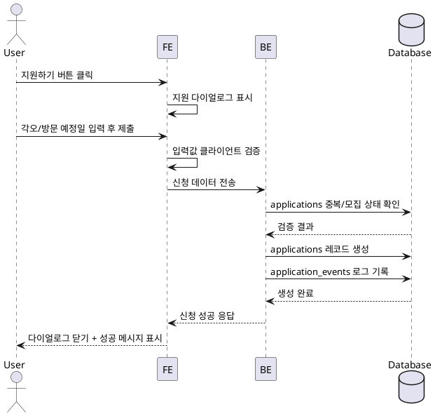

# Use Case: 체험단 지원

## Primary Actor
- 체험단 참여를 희망하며 지원서를 제출하려는 인플루언서 사용자

## Precondition
- 사용자는 인플루언서 역할로 로그인했고, 프로필 및 채널 검증을 완료하여 지원 권한을 가진 상태다.
- 사용자는 모집 중인 체험단 상세 페이지에서 "지원하기" 버튼을 볼 수 있는 상태다.

## Trigger
- 사용자가 체험단 상세 화면에서 "지원하기" 또는 지원 다이얼로그의 제출 버튼을 클릭한다.

## Main Scenario
1. 사용자가 지원 버튼을 누르면 프론트엔드는 지원 다이얼로그를 열어 각오 한마디, 방문 예정일자를 입력할 수 있는 폼을 제공한다.
2. 사용자는 필수 항목을 작성하고 제출 버튼을 클릭한다.
3. 프론트엔드는 클라이언트에서 1차 유효성 검증(텍스트 길이, 날짜 범위)을 수행한 뒤 백엔드 API로 신청 데이터를 전송한다.
4. 백엔드는 `applications` 테이블에서 동일 사용자의 중복 신청 여부를 확인하고, 캠페인이 모집 기간/상태(모집중) 내인지 검증한다.
5. 조건을 통과하면 백엔드는 트랜잭션 내에서 `applications` 레코드를 생성하고, `application_events`에 `submitted` 로그를 기록한다.
6. 백엔드는 성공 응답(신청 ID, 상태 메시지)을 반환하고, 프론트엔드는 다이얼로그를 닫고 성공 토스트와 함께 내 지원 목록 새로고침을 트리거한다.

## Edge Cases
- 모집 기간 종료 또는 모집 상태가 변경된 경우: 백엔드는 오류 코드와 함께 "모집이 종료되었습니다" 메시지를 반환한다.
- 동일 체험단에 이미 신청한 경우: 백엔드는 중복 신청 오류를 반환하고, 프론트엔드는 경고 메시지를 출력한다.
- 방문 예정일이 유효하지 않거나 과거 날짜인 경우: 백엔드는 검증 실패 메시지를 반환한다.
- 네트워크/서버 오류 발생 시: 프론트엔드는 제출 버튼을 재활성화하고 재시도 옵션을 안내한다.

## Business Rules
- 신청은 모집 중(`recruiting`) 상태이며 모집 기간 내인 캠페인에 대해서만 허용된다.
- 동일 인플루언서는 하나의 캠페인에 한 번만 신청할 수 있다.
- 방문 예정일은 현재 날짜 이후여야 하고, 캠페인 기간을 벗어나면 안 된다.
- 모든 신청은 감사 로깅(`application_events`)을 통해 추적되어야 한다.

## Sequence Diagram

