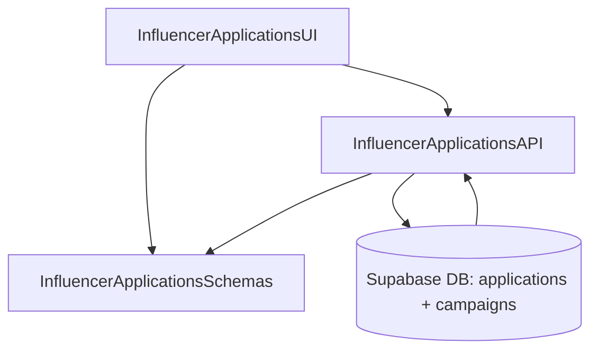

# Implementation Modules Plan (Use Case 7 – 내 지원 목록)

## 개요
- **InfluencerApplicationsAPI** (`src/features/applications/influencer/backend`): 인플루언서 개인의 체험단 신청 목록을 상태 필터와 함께 가져오는 Hono 라우터/서비스.
- **InfluencerApplicationsUI** (`src/features/applications/influencer/components`, `src/app/(protected)/influencer/applications/page.tsx`): 내 지원 목록 테이블과 상태 필터 UI를 제공하는 클라이언트 레이어.
- **InfluencerApplicationsSchemas** (`src/features/applications/lib/dto.ts`): 신청 요약/상태 DTO, 필터 스키마를 프런트·백간 공유.

## Diagram

## Implementation Plan

### InfluencerApplicationsAPI (`src/features/applications/influencer/backend`)
- `schema.ts`: `MyApplicationsFilterSchema`(status 옵션)와 `MyApplicationsResponseSchema` 정의.
- `service.ts`: 현재 사용자 ID로 `applications` 조회, `campaigns`와 조인해 캠페인 제목/마감일/이미지를 포함, 상태 필터(`submitted`, `approved`, `rejected`, `cancelled`) 적용, 최신 상태 업데이트 순으로 정렬.
- `route.ts`: `GET /influencers/applications` 라우터 구현, 인증 context 확인 후 `respond()` 패턴으로 결과 반환.
- 단위 테스트: `tests/features/applications/influencer-service.test.ts`에서 필터별 데이터, 빈 결과, 권한 없는 접근(403) 케이스를 mock Supabase로 검증.

### InfluencerApplicationsUI (`src/features/applications/influencer/components`, `src/app/(protected)/influencer/applications/page.tsx`)
- 컴포넌트: `MyApplicationsTable`, `ApplicationStatusBadge`, `ApplicationFilterBar`. 빈 상태 메시지와 로딩 스켈레톤 포함.
- 훅: `hooks/useMyApplicationsQuery.ts` 작성, React Query로 목록 fetch, 필터 변경 시 refetch.
- 페이지: `/influencer/applications`에서 필터 바 + 테이블 조합, 상세 이동 버튼을 통해 체험단 상세 페이지와 연결.
- QA 시트: `docs/007/qa/my-applications.md` 작성(정상 표시, 빈 목록, 상태 필터 변경, 오류 배너, 상세 이동).

### InfluencerApplicationsSchemas (`src/features/applications/lib/dto.ts`)
- `MyApplicationSummarySchema`, `ApplicationStatusSchema`, `ApplicationFilterSchema` 정의 및 export.
- 단위 테스트: `tests/features/applications/dto.test.ts`에 신청 요약 DTO 파싱 검증 추가.

### 공통 작업
- React Query 키(`applications.mine`)를 `src/lib/react-query/queryKeys.ts`에 등록.
- 캠페인 상세/지원 모듈과 연계하여 신청 성공/선정 시 `useMyApplicationsQuery` invalidation 전략 정의.
- 403 대응을 위한 공통 에러 핸들링(로그인 페이지 이동 또는 경고)을 UI 컴포넌트에 구현.
