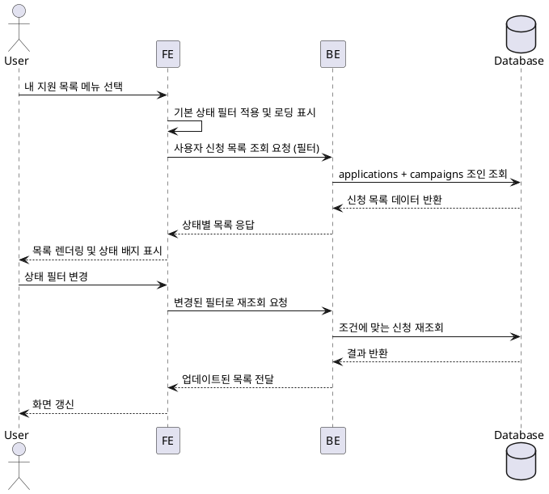

# Use Case: 내 지원 목록 (인플루언서 전용)

## Primary Actor
- 체험단 지원 현황을 확인하려는 인플루언서 사용자

## Precondition
- 사용자는 인플루언서 역할로 로그인돼 있으며, 최소 한 건 이상의 체험단 지원 이력이 존재한다.

## Trigger
- 사용자가 메뉴에서 "내 지원 목록"을 선택하거나 알림에서 지원 현황 확인 버튼을 클릭한다.

## Main Scenario
1. 사용자가 내 지원 목록 화면에 접근하면 프론트엔드는 상태 필터(전체/신청완료/선정/반려)의 기본값을 적용해 로딩 상태를 표시한다.
2. 프론트엔드는 백엔드 API에 사용자의 `applications` 데이터를 상태 필터와 함께 요청한다.
3. 백엔드는 `applications`에서 로그인 사용자의 신청 목록을 상태별로 조회하고, 각 신청과 연결된 `campaigns` 기본 정보를 조인해 카드에 필요한 데이터를 구성한다.
4. 백엔드는 신청 ID, 체험단 제목, 지원 날짜, 현재 상태, 운영 메모 요약(있을 경우)을 포함한 목록을 반환한다.
5. 프론트엔드는 응답을 받아 테이블 또는 카드 형식으로 렌더링하고, 상태별 뱃지를 통해 진행 상황을 표시한다.
6. 사용자가 상세 보기 버튼을 클릭하면 체험단 상세 페이지로 이동하거나, 상태 설명 모달을 띄워 추가 정보를 제공한다.
7. 사용자가 상태 필터를 전환하면 프론트엔드는 동일한 요청 흐름을 반복해 목록을 갱신한다.

## Edge Cases
- 지원 이력이 없는 경우: 백엔드는 빈 배열을 반환하고 프론트엔드는 "지원 이력이 없습니다" 안내를 표시한다.
- 네트워크 오류: 프론트엔드는 오류 메시지와 재시도 버튼을 보여준다.
- 권한 없는 사용자 접근: 백엔드는 403을 반환하고 프론트엔드는 로그인 혹은 역할 변경 안내를 제공한다.
- 오래된 캐시 데이터: 프론트엔드는 새로고침/재조회 버튼을 제공해 최신 상태로 동기화할 수 있게 한다.

## Business Rules
- 목록에는 현재 로그인한 사용자의 신청만 표시된다.
- 상태 필터는 `submitted`, `approved`, `rejected`, `cancelled` 등에 매핑되며, 프론트엔드에서 한국어 라벨로 변환해 노출한다.
- 각 신청 카드/행에는 최근 `status_updated_at`을 표시해 상태 변경 시점을 알 수 있게 한다.
- 선정된 신청(`approved`)은 추가 액션(체험 진행 체크리스트 등)을 바로 이동할 수 있는 버튼을 포함할 수 있다.
- 반려(`rejected`) 상태는 사유가 있는 경우 `application_events` 메모를 함께 표시한다.

## Sequence Diagram

