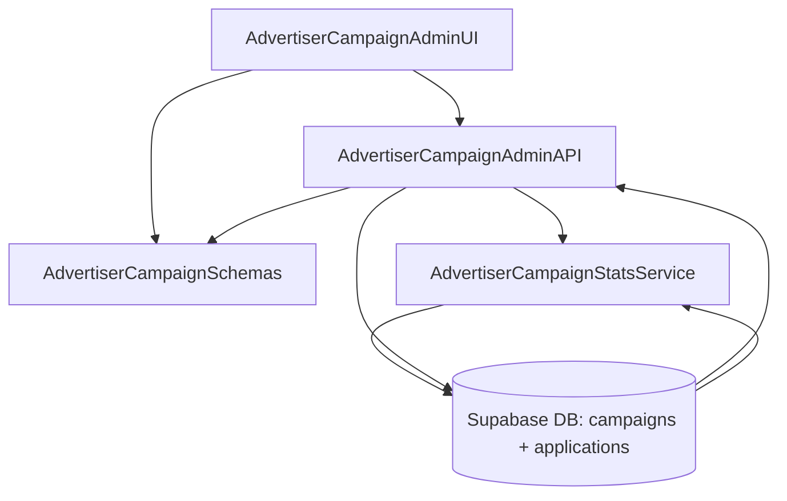

# Implementation Modules Plan (Use Case 8 – 광고주 체험단 관리)

## 개요
- **AdvertiserCampaignAdminAPI** (`src/features/campaigns/admin/backend`): 광고주 체험단 목록 조회, 신규 등록, 권한 검증을 담당하는 Hono 라우터·서비스 계층.
- **AdvertiserCampaignAdminUI** (`src/features/campaigns/admin/components`, `src/app/(protected)/advertiser/campaigns/page.tsx`): 체험단 관리 대시보드, 등록 다이얼로그, 통계 카드를 제공하는 클라이언트 레이어.
- **AdvertiserCampaignSchemas** (`src/features/campaigns/lib/dto.ts`): 광고주 측 캠페인 목록/등록 DTO 및 상태 정보를 프런트·백 간 공유하는 스키마 모듈.
- **AdvertiserCampaignStatsService** (`src/features/campaigns/admin/backend/stats-service.ts`): 지원자 수 등 요약 통계를 계산하는 보조 서비스.

## Diagram

## Implementation Plan

### AdvertiserCampaignAdminAPI (`src/features/campaigns/admin/backend`)
- `schema.ts`: `AdvertiserCampaignListQuerySchema`, `AdvertiserCampaignCreateSchema`(제목, 혜택, 모집 기간, 미션, 매장, 인원), `AdvertiserCampaignListResponseSchema` 정의.
- `service.ts`: 사용자 권한 검증(`advertiser_profiles.verification_status === "approved"`), `campaigns` 목록 페칭(상태별 분류), 신규 캠페인 생성 시 제목+기간 중복 체크, 기본 상태 `recruiting` 설정.
- `route.ts`: `GET /advertisers/campaigns`, `POST /advertisers/campaigns` 구현, `respond()` 패턴 사용, 권한 미승인 시 403 반환.
- `stats-service.ts`: 각 캠페인에 대한 지원자 수/모집 상태 요약 계산(`applications` group by).
- 단위 테스트: `tests/features/campaigns/admin-service.test.ts`에서 성공 목록 조회, 신규 생성, 중복 제목/기간, 권한 실패, 통계 계산 등을 mock Supabase로 검증.

### AdvertiserCampaignAdminUI (`src/features/campaigns/admin/components`, `src/app/(protected)/advertiser/campaigns/page.tsx`)
- 컴포넌트: `CampaignAdminDashboard`, `CampaignSummaryCard`, `CampaignCreateDialog`. `picsum.photos` 이미지를 카드 썸네일로 사용.
- 훅: `hooks/useAdvertiserCampaignsQuery.ts`, `hooks/useCreateCampaignMutation.ts` 작성. React Query로 목록/생성 처리, 성공 시 invalidate 및 토스트 표시.
- 페이지: `/advertiser/campaigns`에서 대시보드 컴포넌트 렌더링, 승인되지 않은 상태에서는 접근 제한 배너 표시.
- QA 시트: `docs/008/qa/advertiser-campaign-admin.md` 작성(목록 로딩, 등록 성공, 중복 오류, 권한 없음, 네트워크 오류, 목록 갱신).

### AdvertiserCampaignSchemas (`src/features/campaigns/lib/dto.ts`)
- `AdvertiserCampaignSummarySchema`, `AdvertiserCampaignCreateInputSchema`, `AdvertiserCampaignStatsSchema` 정의 및 export.
- 단위 테스트: `tests/features/campaigns/dto.test.ts`에 광고주 DTO 파싱 성공/실패 케이스 추가.

### AdvertiserCampaignStatsService (`src/features/campaigns/admin/backend/stats-service.ts`)
- 캠페인별 지원자 수, 모집 상태, 최신 업데이트 시간을 계산하는 함수 작성, service.ts에서 재사용.
- 단위 테스트: `tests/features/campaigns/admin-stats.test.ts`에서 샘플 데이터로 통계 계산 정확도 검증.

### 공통 작업
- React Query 키(`campaigns.advertiser.list`, `campaigns.advertiser.create`)를 `src/lib/react-query/queryKeys.ts`에 추가.
- 새 라우터는 `src/backend/hono/app.ts`에 등록하며 인증/권한 미들웨어가 필요한 경우 `src/backend/middleware`에 재사용 가능한 광고주 권한 가드 구현.
- Campaign 생성 성공 시 브라우저 캐시 무효화를 위해 `useCampaignDetailQuery`, `useCampaignListQuery` 등 관련 쿼리를 invalidate.
