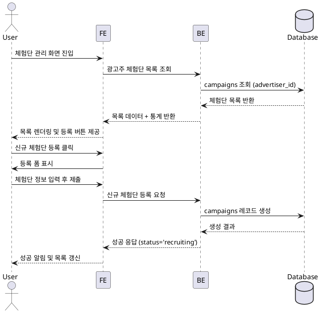

# Use Case: 광고주 체험단 관리

## Primary Actor
- 체험단을 운영하거나 신규 모집을 등록하려는 광고주 사용자

## Precondition
- 사용자는 광고주 역할로 로그인되어 있고 `advertiser_profiles.verification_status = 'approved'` 상태다.
- 최소 한 개 이상의 체험단을 등록할 수 있는 권한이 부여되어 있으며, 대시보드 접근이 허용돼 있다.

## Trigger
- 사용자가 대시보드에서 "체험단 관리" 메뉴를 선택하거나, 새 체험단 등록 버튼을 클릭한다.

## Main Scenario
1. 사용자가 체험단 관리 화면에 접근하면 프론트엔드는 기존에 등록한 체험단 목록과 등록 버튼을 함께 렌더링한다.
2. 프론트엔드는 백엔드에 광고주 ID로 필터링된 `campaigns` 목록 조회를 요청한다.
3. 백엔드는 `campaigns` 테이블에서 해당 광고주의 체험단 목록을 상태별(모집중/모집종료/완료 등)로 조회하고, 각 체험단에 대한 핵심 통계(지원자 수, 모집 상태)를 계산한다.
4. 백엔드는 목록 데이터와 요약 통계를 반환하고, 프론트엔드는 테이블 또는 카드 형태로 렌더링한다.
5. 사용자가 "신규 체험단 등록" 버튼을 클릭하면 프론트엔드는 등록 폼(Dialog)을 띄운다.
6. 사용자가 체험단 정보를 입력 후 제출하면 프론트엔드는 입력값을 검증하고 백엔드 API로 전송한다.
7. 백엔드는 `campaigns`에 새 레코드를 생성하고 기본 상태를 `recruiting`으로 설정한 뒤 성공 응답을 반환한다.
8. 프론트엔드는 성공 메시지를 표시하고 목록을 다시 조회해 갱신된 데이터를 보여준다.

## Edge Cases
- 권한 미승인 상태: 백엔드는 403을 반환하며, 프론트엔드는 "승인 완료 후 이용 가능" 메시지를 안내한다.
- 필수 필드 누락: 프론트엔드는 클라이언트 검증으로 제출을 차단하거나 백엔드에서 400 오류가 반환되면 에러 메시지를 표시한다.
- 동일한 제목/기간 중복: 백엔드는 중복을 감지해 저장을 차단하고 안내 메시지를 반환한다.
- 네트워크 오류: 프론트엔드는 재시도 옵션을 제공하고 폼 입력값을 보존한다.

## Business Rules
- 체험단 등록은 승인된 광고주만 가능하며, 승인 이전에는 등록 버튼이 비활성화된다.
- 기본 상태는 `recruiting`으로 저장되고, 모집 시작·종료 시각은 제출 값의 유효성 검사(시작 < 종료)를 통과해야 한다.
- 동일 광고주의 체험단 제목+기간 조합은 중복 등록할 수 없다.
- 체험단 목록은 최근 수정 순 또는 상태 우선순위(모집중 > 모집종료 > 완료)로 정렬한다.
- 지원자 수 통계는 `applications`에서 집계하며 목록 갱신 시 최신값을 계산한다.

## Sequence Diagram

