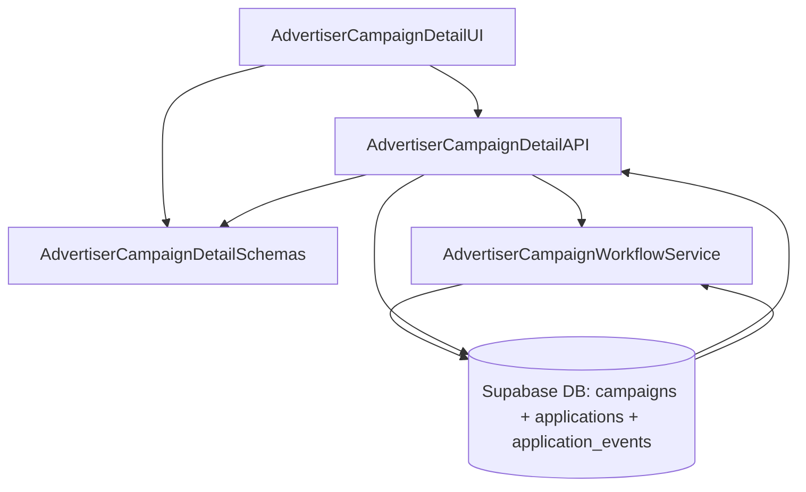

# Implementation Modules Plan (Use Case 9 – 광고주 체험단 상세 & 모집 관리)

## 개요
- **AdvertiserCampaignDetailAPI** (`src/features/campaigns/admin/detail/backend`): 체험단 상세 데이터, 지원자 목록, 모집 종료/선정 액션을 처리하는 Hono 라우터·서비스.
- **AdvertiserCampaignDetailUI** (`src/features/campaigns/admin/detail/components`, `src/app/(protected)/advertiser/campaigns/[id]/page.tsx`): 모집 상태 탭, 지원자 테이블, 모집 종료/선정 UI를 제공하는 클라이언트 레이어.
- **AdvertiserCampaignDetailSchemas** (`src/features/campaigns/lib/dto.ts`, `src/features/applications/lib/dto.ts`): 지원자 요약, 상태 전환 요청/응답 DTO를 공유하는 스키마 모듈.
- **AdvertiserCampaignWorkflowService** (`src/features/campaigns/admin/detail/backend/workflow-service.ts`): 모집 종료, 선정/반려, 재모집 등 상태 전환을 트랜잭션으로 처리하는 비즈니스 로직.

## Diagram

## Implementation Plan

### AdvertiserCampaignDetailAPI (`src/features/campaigns/admin/detail/backend`)
- `schema.ts`: `AdvertiserCampaignDetailParamsSchema`, `AdvertiserApplicantListResponseSchema`, `CloseCampaignRequestSchema`, `ApproveApplicantsRequestSchema` 정의.
- `service.ts`: 체험단 상세 + 지원자 목록 조회(`campaigns` + `applications` join), 상태별 필터, 지원자 메모/노트 포함.
- `route.ts`: `GET /advertisers/campaigns/:id`, `POST /advertisers/campaigns/:id/close`, `POST /advertisers/campaigns/:id/approve`, `POST /advertisers/campaigns/:id/reopen` 라우터 구현. 권한 체크 후 `respond()` 패턴 적용.
- 단위 테스트: `tests/features/campaigns/admin-detail-service.test.ts`에서 상세 조회, 모집 종료 성공/실패, 정원 초과, 재모집, 권한 오류 시나리오를 mock Supabase로 검증.

### AdvertiserCampaignWorkflowService (`src/features/campaigns/admin/detail/backend/workflow-service.ts`)
- 함수 `closeCampaign`, `approveApplicants`, `rejectApplicants`, `reopenCampaign` 구현. 모든 상태 변경은 트랜잭션으로 처리하고 `application_events`에 로그(`status_changed`) 남김.
- 모집 종료는 `recruiting -> recruitment_closed`, 재모집은 역방향(`recruitment_closed -> recruiting`)으로 상태 전환.
- 단위 테스트: `tests/features/campaigns/admin-workflow.test.ts`에서 상태 전환/트랜잭션 롤백/정원 초과/동시성 실패 케이스 검증.

### AdvertiserCampaignDetailUI (`src/features/campaigns/admin/detail/components`, `src/app/(protected)/advertiser/campaigns/[id]/page.tsx`)
- 컴포넌트: `CampaignDetailOverview`, `ApplicantStatusTabs`, `ApplicantTable`, `ManageApplicantsDialog`. `picsum.photos` 이미지를 헤더에 사용.
- 훅: `hooks/useAdvertiserCampaignDetailQuery.ts`, `hooks/useCloseCampaignMutation.ts`, `hooks/useApproveApplicantsMutation.ts`, `hooks/useReopenCampaignMutation.ts` 작성. React Query로 상태 전환 후 invalidate.
- 페이지: `/advertiser/campaigns/[id]/page.tsx`에서 상세 컴포넌트 조합, 상태 변경 시 Toast/모달 확인 UI 제공.
- QA 시트: `docs/009/qa/advertiser-campaign-detail.md` 작성(상세 조회, 모집 종료, 재모집, 선정, 정원 초과, 권한 없음, 동시성 오류).

### AdvertiserCampaignDetailSchemas (`src/features/campaigns/lib/dto.ts`, `src/features/applications/lib/dto.ts`)
- `AdvertiserCampaignDetailSchema`, `ApplicantSummarySchema`, `CloseCampaignRequestSchema`, `ApproveApplicantsRequestSchema`, `CampaignStatusEnum` 등 정의/확장.
- 단위 테스트: `tests/features/campaigns/dto.test.ts`에 상세 DTO, 상태 전환 요청 파싱 검증 추가.

### 공통 작업
- React Query 키(`campaigns.advertiser.detail`, `campaigns.advertiser.close`, `campaigns.advertiser.approve`)를 `src/lib/react-query/queryKeys.ts`에 추가.
- `src/backend/hono/app.ts`에 신규 라우터 등록, 광고주 권한 미들웨어 재사용.
- 상태 전환 성공 시 관련 쿼리(`campaigns.advertiser.list`, `campaigns.detail`, `applications.mine`) invalidate 전략 정의.
