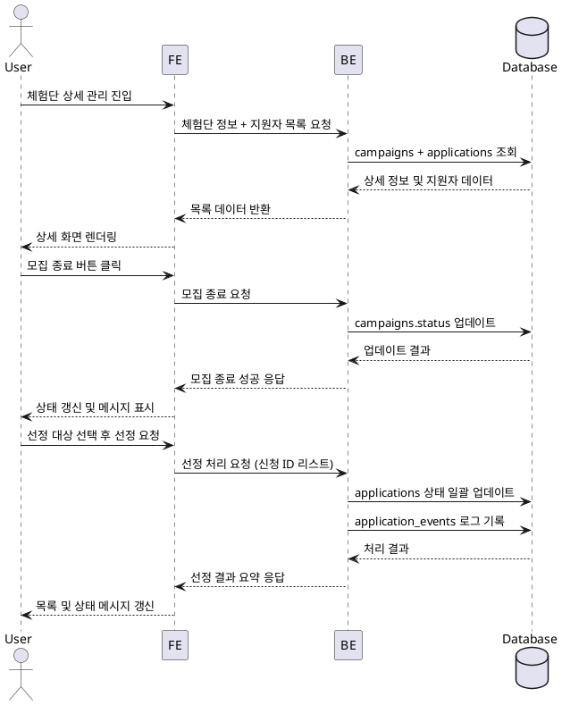

# Use Case: 광고주 체험단 상세 & 모집 관리

## Primary Actor
- 등록한 체험단의 모집 상황을 관리하려는 광고주 사용자

## Precondition
- 사용자는 광고주 역할로 로그인되어 있으며 해당 체험단의 소유자다.
- 체험단은 `campaigns`에 생성된 상태이고 기본 상태는 `recruiting`이다.

## Trigger
- 사용자가 체험단 관리 목록에서 특정 체험단을 선택하거나, 모집 종료/선정 관련 알림에서 상세 관리 버튼을 클릭한다.

## Main Scenario
1. 사용자가 체험단 상세 관리 화면에 접근하면 프론트엔드는 체험단 ID를 기준으로 로딩 상태를 표시한다.
2. 프론트엔드는 백엔드에 체험단 상세 정보와 지원자 목록(상태 포함)을 요청한다.
3. 백엔드는 `campaigns`에서 기본 정보와 모집 상태를 가져오고, `applications`에서 지원자 리스트와 각 상태(신청완료, 선정, 반려)를 조회한다.
4. 백엔드는 지원자별 주요 필드(인플루언서 이름, 채널, 신청 일시, 상태, 노트)를 포함한 데이터를 반환한다.
5. 프론트엔드는 목록을 렌더링하고, 모집 상태별 탭/필터 및 모집 종료/선정 액션 버튼을 표시한다.
6. 사용자가 "모집 종료" 버튼을 클릭하면 프론트엔드는 확인 모달을 띄우고, 확정 시 백엔드에 상태 전환 요청을 보낸다.
7. 백엔드는 트랜잭션 내에서 `campaigns.status`를 `recruitment_closed`로 업데이트하고 성공 응답을 반환한다.
8. 사용자가 지원자를 선택해 "선정 완료" 버튼을 클릭하면 프론트엔드는 선택된 신청 ID 리스트와 함께 백엔드에 승인 요청을 보낸다.
9. 백엔드는 `applications`의 해당 레코드를 `approved`로 업데이트하고, 다른 지원자가 있을 경우 `rejected`로 일괄 변경하며, `application_events`에 로그를 남긴다.
10. 백엔드는 결과 요약(선정 인원, 거절 인원, 남은 슬롯)을 반환하고 프론트엔드는 목록과 상태 메시지를 갱신한다.

## Edge Cases
- 모집 종료 후 재모집 요청: 백엔드는 상태 변경 권한을 확인하고 조건에 따라 `recruiting`으로 복구하거나 오류 메시지를 반환한다.
- 선정 인원 초과 선택: 백엔드는 모집 정원 초과 시 요청을 거절하고 허용 가능한 최대 인원을 안내한다.
- 지원자 데이터 동시 수정 충돌: 백엔드는 동시성 제약을 적용하고 실패 시 재시도 요청을 반환한다.
- 권한 없는 사용자 접근: 백엔드는 403을 반환하고 프론트엔드는 접근 제한 안내를 표시한다.

## Business Rules
- 모집 종료는 `recruiting` 상태에서만 수행할 수 있으며, 종료 후에는 신규 지원을 받을 수 없다.
- 선정은 모집 종료 상태(`recruitment_closed`)에서만 가능하며, 선정 인원 수는 `max_participants`를 초과할 수 없다.
- 선정/반려 처리 시 `application_events`에 로그를 남겨 감사 추적을 보장한다.
- 상태 변경은 모두 트랜잭션으로 처리하여 부분만 적용되는 것을 방지한다.
- 상태 변경 후 프론트엔드는 최신 데이터를 다시 조회해 사용자에게 최신 상태를 제공한다.

## Sequence Diagram

